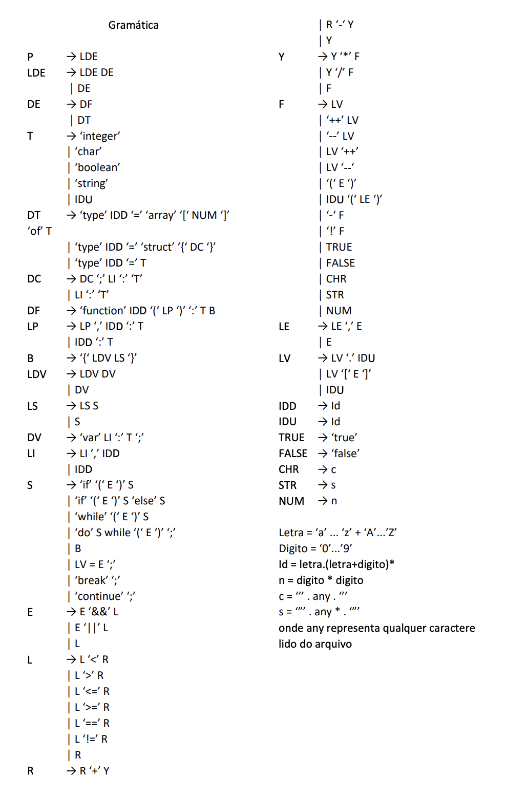

# Lexical Analyzer in Python

This repository contains a complete lexical analyzer built in Python for a simple, C-like scripting language. The analyzer scans a source code file, converts it into a stream of tokens, builds a symbol table, and reports any unrecognized characters.

---

### What is a Lexical Analyzer?

A lexical analyzer, also known as a **scanner**, is the first phase of a compiler. Its main responsibility is to read the raw source code as a stream of characters and group them into meaningful sequences called **lexemes**. For each valid lexeme, it generates a corresponding **token**, which is typically a numerical value that represents the lexeme's category (e.g., 'identifier', 'keyword', or 'operator').

This process simplifies the work for the next phase (the parser) by abstracting the raw text into a uniform stream of tokens. For example, different identifiers like `my_variable` and `counter` are both categorized under a single `ID` token. To distinguish them, the analyzer also provides a **secondary token** (often a pointer to a symbol table entry) that holds the actual value or reference for the lexeme.

Because the set of all valid lexemes in a programming language can be described by regular expressions, a lexical analyzer is typically implemented as a **Finite Automaton**.

---


### Running the Analyzer

To analyze a source code file (e.g., `test.txt`), run the `lexical.py` script from your terminal and pass the filename as a command-line argument:

```bash
python lexical.py test.txt
```

The program will print the stream of recognized tokens followed by the final state of the Symbol Table.

---

### Grammar

Here is the grammar that the lexical analyzer is built to recognize:


